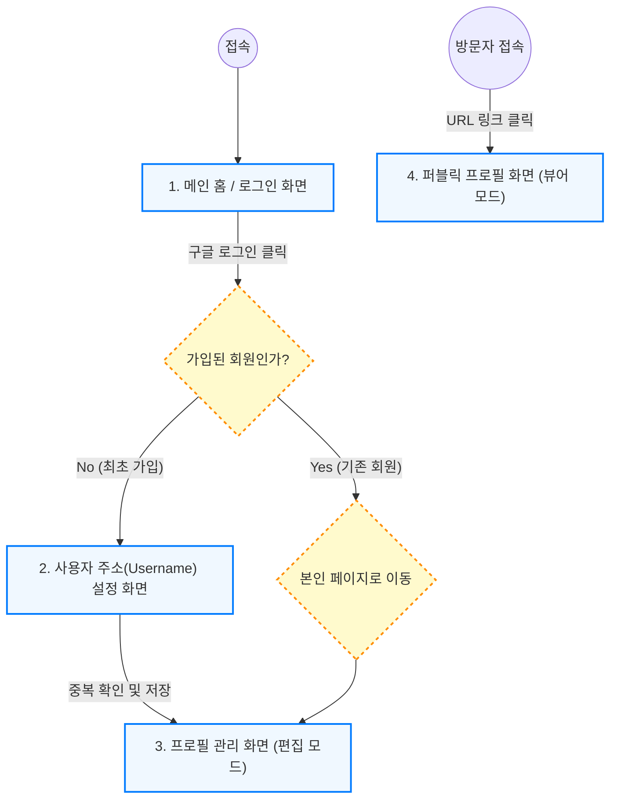

# 마이링크 (MyLink) 상세 화면 설계 (Wireframe & Flow)

본 문서는 마이링크 서비스의 전체 화면 구성, UI 컴포넌트 동작 방식, 기기별 반응형 레이아웃 규칙 및 사용자 상호작용(Interaction)을 구체적으로 정의합니다.

---

## 1. 전체 사용자 여정 및 화면 흐름 (User Journey)



---

## 2. 화면별 상세 UI 및 인터랙션 정의

### 2.1 메인 홈 및 로그인 화면 (`/`)

* **목적**: 서비스 목적 소개 및 사용자 로그인 유도
* **레이아웃**: 브라우저 창 전체(100vh)를 차지하는 중앙 정렬 레이아웃입니다. 모바일 기기에서도 자연스러우며, 데스크탑에서는 좌우 여백을 넓게 가져갑니다.

```text
+-------------------------------------------------------------+
| [MyLink Logo]                                    [로그인]   |
|                                                             |
|                          마이링크                           |
|             하나의 링크로 당신의 모든 것을 공유하세요.              |
|                                                             |
|                 +-----------------------+                   |
|                 | [G] 구글 계정으로 시작하기|                   |
|                 +-----------------------+                   |
|                                                             |
+-------------------------------------------------------------+
```
**인터랙션 상세 (Interaction)**:
- **버튼 호버(Hover)**: 마우스를 올리면 버튼의 배경색이 살짝 어두워지며 포인터가 손가락 모양으로 바뀝니다.
- **오류 처리**: 구글 로그인 연동 실패 및 취소 시, 화면 하단에 붉은색 토스트(Toast) 팝업으로 "로그인에 실패했습니다. 다시 시도해주세요." 안내를 표시합니다.

---

### 2.2 사용자 고유 주소(Username) 설정 화면 (`/setup`)

* **목적**: 퍼블릭 URL로 사용될 고유 ID 생성
* **특징**: 회원가입 직후 최초 1회만 접근합니다. 설정 완료 시 다시 접근할 수 없습니다.

```text
+-------------------------------------------------------------+
|                                                             |
|                      프로필 주소 설정                       |
|           마이링크에서 사용할 고유 주소를 입력해주세요.             |
|                                                             |
|            +-----------------------------------+            |
|            | mylink.com/  [  username 입력  ]  |            |
|            +-----------------------------------+            |
|             (안내 텍스트: 이미 사용 중인 주소입니다.)               |
|                                                             |
|                 +-----------------------+                   |
|                 |      저장 및 시작하기     |                   |
|                 +-----------------------+                   |
|                                                             |
+-------------------------------------------------------------+
```
**유효성 검사 및 로직 (Validation)**:
- **입력 제한**: 영문 소문자, 숫자, 마침표(.), 밑줄(_), 하이픈(-)만 허용합니다. (띄어쓰기 불가)
- **실시간 중복 체크**: 입력을 마치고 포커스를 벗어나거나(onBlur) 타이핑이 잠시 멈췄을 때(Debounce) DB를 조회하여 중복 여부를 체크합니다.
- **제어**: 중복된 주소이거나 조건에 맞지 않을 경우 붉은색 텍스트로 에러를 알리고 하단 버튼을 비활성화(Disabled) 상태로 만듭니다.

---

### 2.3 마이링크 관리 및 퍼블릭 조회 화면 (`/:username`)

이 화면은 사용자의 권한(소유자인지 방문자인지)에 따라 동적으로 변경됩니다.
데스크탑의 넓은 화면에서는 좌우 폭을 약 500~600px로 제한하여 스마트폰에서 보는 것과 유사한 카드형 컨테이너를 화면 중앙에 고정합니다.

#### A. 관리자 편집 모드 (소유자 본인 접속 시)

```text
+-------------------------------------------------------------+
|                                              [공유] [로그아웃]|
|                        .-------.                            |
|                       /         \                           |
|                      |   Image   |                          |
|                       \         /                           |
|                        `-------'                            |
|                       (사진 변경 아이콘)                      |
|                                                             |
|                 [ 사용자 이름 (Name) 수정창 ]                 |
|                                                             |
|            [ 짧은 소개글 (Bio) 멀티라인 텍스트 수정창 ]         |
|                                                             |
|      +-----------------------------------------------+      |
|      | [파비콘] [  내 블로그 구경하기 (타이틀 수정) ]     🗑️ |      |
|      |         [  https://blog.example.com 수정  ]         |      |
|      +-----------------------------------------------+      |
|                                                             |
|      + - - - - - - - - - - - - - - - - - - - - - - - +      |
|      |                 ➕ 새 링크 추가                   |      |
|      + - - - - - - - - - - - - - - - - - - - - - - - +      |
|                      Powered by MyLink                      |
+-------------------------------------------------------------+
```
**동작 로직**:
1. **사진 변경**: 프로필 원형 영역 중앙 카메라 아이콘을 클릭하면 OS의 파일 탐색기가 열립니다. 파일 선택 시 자동으로 Firestore 스토리지에 업로드되며 원형으로 크롭되어 반영됩니다.
2. **텍스트 인라인 편집 & 자동 저장**:
   - 텍스트 영역을 클릭하면 입력 상태(Focus)로 전환됩니다.
   - 수정을 마치고 바깥 영역을 클릭(onBlur)하거나 `Enter` 키를 누르면 **저장 버튼 없이도 Firestore에 자동 저장(Auto-save)** 됩니다.
   - 링크가 비어있는 상태로 저장하려 하면 저장되지 않고 붉은 테두리로 경고합니다.
3. **링크 아이템 추가 및 삭제**:
   - `[➕ 새 링크 추가]` 버튼을 누르면 목록 최하단에 새로운 빈 폼이 나타납니다.
   - 우측 `[🗑️]` 휴지통 아이콘 클릭 시, 브라우저의 기본 `confirm()` 알림창("이 링크를 정말 삭제하시겠습니까?")을 띄워 실수로 인한 삭제를 방지합니다.

#### B. 방문자 뷰어 모드 (타인 접속 시)

```text
+-------------------------------------------------------------+
|                                                      [공유] |
|                        .-------.                            |
|                       /         \                           |
|                      |   Image   |                          |
|                       \         /                           |
|                        `-------'                            |
|                                                             |
|                       사용자 이름                             |
|                                                             |
|                     짧은 소개글 텍스트                        |
|                                                             |
|      +-----------------------------------------------+      |
|      | [파비콘]         내 블로그 구경하기                 |      |
|      +-----------------------------------------------+      |
|      +-----------------------------------------------+      |
|      | [파비콘]          일상 인스타그램                   |      |
|      +-----------------------------------------------+      |
|                                                             |
|                      Powered by MyLink                      |
+-------------------------------------------------------------+
```
**동작 로직**:
1. **링크 이동 처리**: 방문자가 직사각형 링크 버튼을 클릭하면, 대상 URL이 새로운 브라우저 탭(`target="_blank" rel="noopener noreferrer"`)으로 안전하게 열립니다.
2. **말줄임표 처리 (Truncate)**: 링크 제목 텍스트가 너무 길어 버튼 밖으로 벗어날 위험이 있을 경우, 끝부분을 줄임표(`...`)로 자동 생략 처리합니다.
3. **링크가 없는 빈 상태 (Empty State)**: 등록된 링크가 한 개도 없다면 빈 화면 대신 중앙에 연한 회색 글씨로 "아직 등록된 링크가 없습니다."를 표시하여 방문자의 혼란을 줄입니다.
4. **공유하기**: 우측 상단 `[공유]` 버튼 클릭 시, 모바일 기기라면 기기 자체 공유 메뉴(Web Share API)가 나타나고 PC 환경이라면 클립보드에 URL이 복사되며 "주소가 복사되었습니다." 알림이 표시됩니다.
