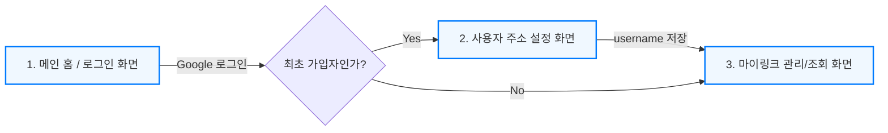

# 마이링크 (MyLink) 화면 와이어프레임 및 시나리오 흐름

이 문서는 MyLink의 전체 사용자 시나리오 흐름(로그인 -> 초기 설정 -> 링크 관리 및 공유)에 따른 화면 구성을 보여줍니다. 특정 기기에 종속되지 않는(모바일 우선 X) 반응형(Responsive) 레이아웃을 기준으로 작성되었습니다.

## 1. 전체 화면 흐름도 (Mermaid)



## 2. 화면별 와이어프레임 (ASCII Art)

### 2.1 메인 홈 / 로그인 화면 (`/`)
사용자가 서비스에 접속하여 로그인을 진행하는 랜딩 페이지입니다. 반응형 중앙 정렬 레이아웃입니다.

```text
+-------------------------------------------------------------+
|                                                  [로그인]   |
|                                                             |
|                                                             |
|                          마이링크                           |
|                                                             |
|             하나의 링크로 당신의 모든 것을 공유하세요.              |
|                                                             |
|                 +-----------------------+                   |
|                 | [G] 구글로 시작하기      |                   |
|                 +-----------------------+                   |
|                                                             |
|                                                             |
|                                                             |
+-------------------------------------------------------------+
```

### 2.2 고유 주소(Username) 설정 화면 (`/setup`)
최초 가입 시 본인의 고유한 접속 URL(`mylink.com/username`)을 생성하는 단계입니다.

```text
+-------------------------------------------------------------+
|                                                             |
|                                                             |
|                      프로필 주소 설정                       |
|                                                             |
|           마이링크에서 사용할 고유 주소를 입력해주세요.             |
|                                                             |
|            +-----------------------------------+            |
|            | mylink.com/  [  username 입력  ]  |            |
|            +-----------------------------------+            |
|                                                             |
|                 +-----------------------+                   |
|                 |      저장 및 시작하기     |                   |
|                 +-----------------------+                   |
|                                                             |
+-------------------------------------------------------------+
```

### 2.3 마이링크 관리 및 퍼블릭 조회 화면 (`/:username`)
자신의 페이지에서는 '인라인 편집' 모드가 활성화되어 직접 프로필과 링크를 수정할 수 있고, 타인이 방문할 경우 수정 UI가 숨겨진 깔끔한 '뷰어 모드'가 됩니다.

```text
+-------------------------------------------------------------+
|                                              [공유] [로그아웃]|
|                                                             |
|                        .-------.                            |
|                       /         \                           |
|                      |   Image   |                          |
|                       \         /                           |
|                        `-------'                            |
|                            ✏️                                |
|                                                             |
|                  사용자 이름 (Name)  ✏️                       |
|                                                             |
|              짧은 소개글 (Bio) 적는 곳  ✏️                     |
|                                                             |
|                                                             |
|      +-----------------------------------------------+      |
|      | [G_icon] 내 블로그 구경하기 (https://...) ✏️  🗑️ |      |
|      +-----------------------------------------------+      |
|                                                             |
|      +-----------------------------------------------+      |
|      | [I_icon] 일상 인스타그램 (https://...)   ✏️  🗑️ |      |
|      +-----------------------------------------------+      |
|                                                             |
|      + - - - - - - - - - - - - - - - - - - - - - - - +      |
|      |                 ➕ 새 링크 추가                   |      |
|      + - - - - - - - - - - - - - - - - - - - - - - - +      |
|                                                             |
|                      Powered by MyLink                      |
+-------------------------------------------------------------+
* ✏️(편집 아이콘), 🗑️(삭제 아이콘) 및 [➕ 새 링크 추가] 영역은 
  현재 접속한 사용자가 해당 페이지의 소유자일 경우에만 표시됩니다.
* 데스크탑에서는 좌우 여백을 넓게 가져가고 화면 중앙에 컨텐츠가 배치되어 깔끔하게 표시됩니다.
```
