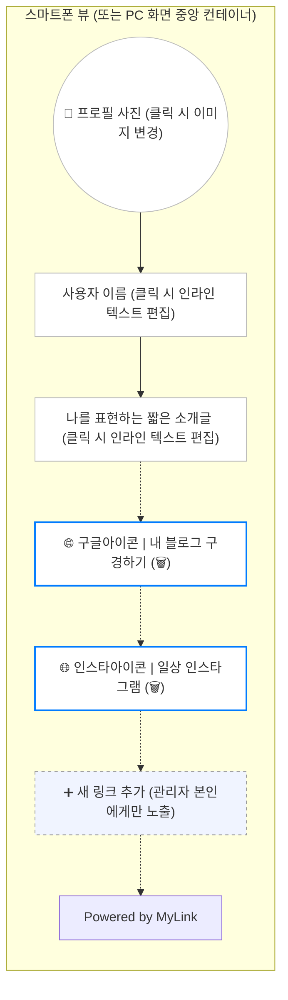

# 마이링크 (MyLink) 화면 와이어프레임

이 문서는 MyLink 메인 페이지의 전체적인 레이아웃과 인라인 편집 모드의 구성을 시각적으로 나타냅니다. 모바일 우선(Mobile-first) 디자인을 기준으로 작성되었습니다.

## 1. 퍼블릭 페이지 및 편집 화면 레이아웃



## 2. 화면 구성 요소 상세 설명

1. **프로필 이미지 (`P_Img`)**
   - 화면 최상단 중앙에 위치합니다. 
   - 원형 프레임으로 표시되며, 페이지 소유자가 클릭 시 파일 탐색기가 열려 즉시 사진을 변경할 수 있습니다.
2. **이름 및 소개글 (`P_Name`, `P_Bio`)**
   - 프로필 사진 하단에 위치합니다. 
   - 일반 방문자에게는 단순 텍스트로 보이지만, 소유자가 텍스트를 클릭하면 해당 영역이 즉시 입력창(Input/Textarea)으로 변하여 인라인 편집이 가능해집니다.
3. **링크 아이템 (`L_1`, `L_2`)**
   - 가로로 긴 둥근 형태의 버튼 박스로 렌더링됩니다.
   - 왼쪽: 입력된 URL을 기반으로 자동 추출된 **파비콘(Favicon)** 아이콘이 표시됩니다.
   - 중앙: 링크의 제목이 텍스트로 표시되며, 소유자 클릭 시 제목과 URL을 즉시 수정할 수 있습니다.
   - 우측: 소유자에게만 보이는 **휴지통(삭제) 아이콘**이 배치됩니다. 클릭 시 확인 절차 후 링크가 제거됩니다.
4. **새 링크 추가 버튼 (`L_Add`)**
   - 기존 링크 목록 하단에 점선 테두리 등의 형태로 눈에 띄게 위치합니다.
   - 클릭하면 빈 상태의 새 링크 아이템 블록이 화면에 즉시 생성되어 입력할 수 있습니다.

---

## 3. 아스키 아트 (ASCII Art) 와이어프레임

```text
+-------------------------------------------------+
|                                           [공유]|
|                                                 |
|                    .-------.                    |
|                   /         \                   |
|                  |   Image   |                  |
|                   \         /                   |
|                    `-------'                    |
|                        ✏️                        |
|                                                 |
|           이름 (Name)  ✏️                       |
|                                                 |
|        짧은 소개글 (Bio) 적는 곳  ✏️             |
|                                                 |
|                                                 |
|  +-------------------------------------------+  |
|  | [G]  내 블로그 구경하기 (https://...)  ✏️  🗑️ |  |
|  +-------------------------------------------+  |
|                                                 |
|  +-------------------------------------------+  |
|  | [I]  일상 인스타그램 (https://...)    ✏️  🗑️ |  |
|  +-------------------------------------------+  |
|                                                 |
|  + - - - - - - - - - - - - - - - - - - - - - +  |
|  |             ➕ 새 링크 추가               |  |
|  + - - - - - - - - - - - - - - - - - - - - - +  |
|                                                 |
|                                                 |
|               Powered by MyLink                 |
+-------------------------------------------------+
* ✏️(편집) 및 🗑️(삭제) 기호는 로그인한 소유자(관리자)에게만 노출됩니다.
```

## 4. UI 구성 관련 제안 및 질문 사항 (Open Questions)

1. **상단 헤더 액션 버튼 (Header Actions)**
   - **질문**: 방문자가 이 페이지를 다른 곳으로 쉽게 공유할 수 있도록 우측 상단에 '공유하기' 버튼(아스키 아트 참고)을 추가하는 것이 어떨까요?
   - **질문**: 페이지 소유자가 로그아웃을 하거나, 계정을 관리(회원탈퇴 등)할 수 있는 '설정/로그아웃' 메뉴는 우측 상단에 햄버거 메뉴(≡)로 배치할까요, 아니면 페이지 맨 하단(Footer 위)에 작게 배치할까요?
2. **링크가 하나도 없는 경우 (Empty State 처리)**
   - **제안**: 가입 직후 링크가 0개일 때 빈 화면만 보이면 당황스러울 수 있습니다. 방문자에게는 "아직 등록된 링크가 없습니다."라고 표시하고, 소유자에게는 "➕ 첫 번째 링크를 추가해 보세요!"라는 친절한 안내 문구를 보여주는 것을 제안합니다.
3. **텍스트 길이가 매우 길 경우의 처리**
   - **질문**: 링크의 제목이나 URL이 모바일 가로 폭을 넘길 정도로 매우 긴 경우, 영역이 계속 늘어나게(Wrapping) 둘까요, 아니면 한 줄만 보여주고 말줄임표(`...`)로 자르는 것이 좋을까요? 모바일 화면의 깔끔함을 위해 한 줄 말줄임표 적용을 추천합니다.
